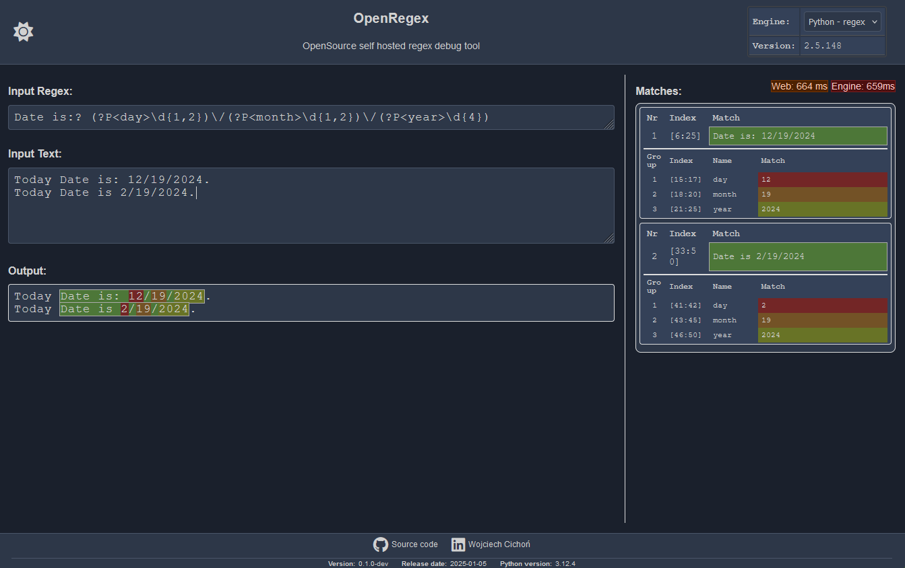

# OpenRegex

OpenRegex is a simple, self-hosted, web-based regular expression (regex) tester and debugger.



## Features

* **Web Interface:** Access the tool through a user-friendly web browser.
* **Self-Hosted:** Run the application on your own infrastructure for complete control and privacy.
* **Simple Setup:** Relatively easy installation with clear instructions.
* **Multiple Engine Support:**

  | Engine         | Description                                                                   |
       |----------------|-------------------------------------------------------------------------------|
  | Python `re`    | Python's built-in regex engine.                                               |
  | Python `regex` | Python's `regex` module, which supports additional features like lookbehinds. |
  | Java           | Java's `java.util.regex` built-in regex engine.                               |
  | C++            | C++'s `std::regex` engine.                                                    |

## Requirements

* **Python:** 3.10 or later (required)
* **OpenJDK:** Required for Java regex engine.
* **g++:** Required for C++ regex engine.
* **Docker:** Optional for containerized deployment.
* **Basic Familiarity with Command Line:** For setting up the environment and running commands.

## Installation

These instructions will help you set up OpenRegex on your local machine.

1. **Set up a virtual environment (Recommended):**

   It's best practice to use a virtual environment to keep your project dependencies isolated.

   ```bash
   python -m venv .venv
   source .venv/bin/activate # On Linux/macOS
   # Or on Windows: .venv\Scripts\activate
   ```

2. **Install Python Dependencies:**

   ```bash
   python -m pip install --upgrade pip
   pip install -r requirements.txt
   ```

3. **Install OpenJDK (Java Development Kit):**

   You'll need a Java Development Kit for the Java regex engine.

    * **Windows:**
      Download the latest OpenJDK
      from [Microsoft's OpenJDK download page](https://learn.microsoft.com/en-us/java/openjdk/download).
      Follow the installation instructions provided by Microsoft.
      After installation, make sure the `java` and `javac` executables are in your system's `PATH` environment variable.
    * **Linux:**
      You can use your distribution's package manager or follow the steps below for downloading directly:

      ```bash
      # Download and install JDK 23.0.1 (or the latest version)
      curl -fsSL https://download.java.net/java/GA/jdk-23.0.1/c28985cbf10d4e648e4004050f8781aa/11/GPL/openjdk-23.0.1_linux-x64_bin.tar.gz \
      | tar -xz -C /usr/local
      sudo ln -s /usr/local/jdk-23.0.1 /usr/local/java

      # Set JAVA_HOME environment variable
      export JAVA_HOME=/usr/local/java

      # Add PATH to include Java binaries
      export PATH="$JAVA_HOME/bin:$PATH"

      # You might want to add these exports to your .bashrc or .zshrc
      ```

4. **Install g++ (C++ Compiler):**

   You'll need a C++ compiler for the C++ regex engine.

    * **Windows:**
        1. Install MSYS2 from [MSYS2 Download Page](https://www.msys2.org/).
        2. Open the MSYS2 terminal and run the following command:
           ```bash
           pacman -S mingw-w64-ucrt-x86_64-gcc
           ```
        3. Add the g++ binary to your system's PATH environment variable. Typically, this is located at:
           `C:\msys64\ucrt64\bin`. You can do this using the system environment settings or with:
             ```bash
            setx PATH "%PATH%;C:\msys64\ucrt64\bin"
             ```
           Note: You may need to restart your terminal or computer for these changes to take effect.
    * **Linux:**
      ```bash
      sudo apt-get update  # (Optional, but recommended)
      sudo apt-get install g++
      ```

5. **Run the Application:**

   From the root directory of the project (where `app.py` is located), run:

   ```bash
   python app.py
   ```

   The application should start, and you should be able to access it in your web browser at `http://localhost:5000`.

## Using Docker

If you prefer using Docker, you can build and run the application in a container or pull the image from Docker Hub.

**Building and Running the Docker Container:**

1. **Build the Docker Image:**

   Navigate to the directory containing your `Dockerfile` and run:

   ```bash
   docker build -t openregex .
   ```

2. **Run the Docker Container:**
   Use the following command to start a container with environment variables and port mapping:

   ```bash
   docker run -e OPENREGEX_LOG_LEVEL=INFO -e OPENREGEX_TIMEOUT_S=5 -p 5000:5000 openregex
   ```
3. **Access the Application:**

   Open your web browser and go to `http://localhost:5000` to access the application.

**Pull Docker hub:**

1. **Pull the Docker Image:**

    You can also pull the image from Docker Hub:
    
   ```bash
   docker run -e OPENREGEX_LOG_LEVEL=INFO -e OPENREGEX_TIMEOUT_S=5 -p 5000:5000 sunnev/openregex
   ```
2. **Access the Application:**

   Open your web browser and go to `http://localhost:5000` to access the application.