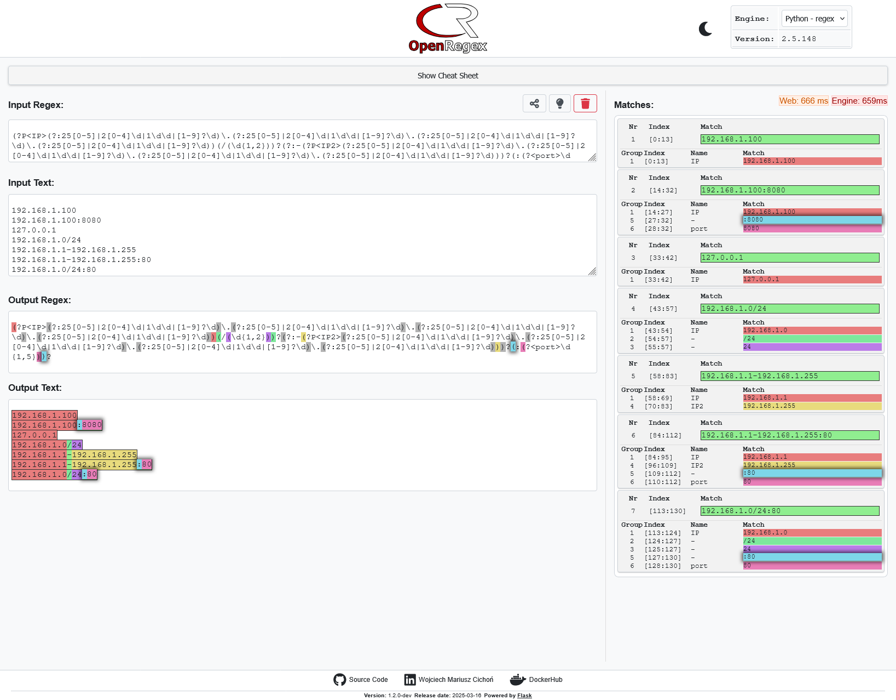

# OpenRegex

[]()
[](https://hub.docker.com/r/sunnev/openregex)
[]()    
[](https://github.com/sunnev/openregex/tags)


Official website: **[OpenRegex.com](https://www.openregex.com)**

OpenRegex is an open-source, self-hosted web application for testing and debugging regular expressions (regex).

## Screenshots




## Features

* **Web Interface:** Access the tool through a user-friendly web browser.
* **Self-Hosted:** Run the application on your own infrastructure for complete control and privacy.
* **Simple Setup:** Relatively easy installation with clear instructions.
* **Link support:** Easily share links with others to test regular
  expressions. [Example](https://openregex.com/?link=eJx9kEFPwkAQhf_K2BNF2k3UEyElJiR6EgIRD50eSpnSxrLb7G5BRf6700WaJiaedifz3jfz5uRpb-yFw8F0jGgG08Xksa5f0j1F8zgNvpLT_XmJODs9nH3_28l-Na-6ihTiaogYZmrv83MRLCZPpS2aTVRYW5uxELvSxojHUCS3ztvYQukoNqvETWDAMT6sE_8qumJmKnsn_dwj_cXc_cfxRp7lcG9U8YIEVsG8JrmkHX2MwBYEGzIWdFuD5S_pG5TzPC-zMq3gSBswpSVQbHKiNmeIsquhNK4ZGNXojCCVWzBU5VAohm3DHkxTraB3EL5PSxOrRkpai24vlJfUwAJodNV5WsPWtZxPC9M6D6JbBiXHJY67-OTDSAh4pnf-AUszo1c)
* **Multiple Engine Support:**

  | Engine     | Description                                                                           | Documentation                                                                                                |
    |------------|---------------------------------------------------------------------------------------|--------------------------------------------------------------------------------------------------------------|
  | Python     | `re` Python's built-in regex engine.                                                  | [Link](https://docs.python.org/3.12/library/re.html)                                                         |
  | Python     | `regex` Python's `regex` module, which supports additional features like lookbehinds. | [Link](https://pypi.org/project/regex/)                                                                      |                                                    
  | Java       | Java's `java.util.regex` built-in regex engine.                                       | [Link](https://download.java.net/java/early_access/valhalla/docs/api/java.base/java/util/regex/Pattern.html) |
  | JavaScript | JavaScript's `Node.js` provides a `RegExp` object.                                    | [Link](https://developer.mozilla.org/en-US/docs/Web/JavaScript/Guide/Regular_Expressions)                    |                                                                                                      |                                                                                                              
  | C++        | C++'s `std::regex` engine.                                                            | [Link](https://cplusplus.com/reference/regex/)                                                               |                                                                                                            |

## Requirements

* **Python:** 3.12 or later (required)
* **OpenJDK:** Required for Java regex engine.
* **Node.js:** Required for JavaScript regex engine.
* **g++:** Required for C++ regex engine.
* **Docker:** Optional for containerized deployment.
* **Basic Familiarity with Command Line:** For setting up the environment and running commands.

## Installation

These instructions will help you set up OpenRegex on your local machine.

1.  **Set up a virtual environment (Recommended):**

    It's best practice to use a virtual environment to keep your project dependencies isolated.

    ```bash
    python -m venv .venv
    source .venv/bin/activate # On Linux/macOS
    # Or on Windows: .venv\Scripts\activate
    ```

2.  **Install Python Dependencies:**

    ```bash
    python -m pip install --upgrade pip
    pip install -r requirements.txt
    ```

3.  **Install OpenJDK (Java Development Kit):**

    You'll need a Java Development Kit for the Java regex engine.

    *   **Windows:**
        Download the latest OpenJDK
        from [Microsoft's OpenJDK download page](https://learn.microsoft.com/en-us/java/openjdk/download).
        Follow the installation instructions provided by Microsoft.
        After installation, make sure the `java` and `javac` executables are in your system's `PATH` environment variable.
    *   **Linux:**
        You can use your distribution's package manager (e.g., `sudo apt install default-jdk` on Debian/Ubuntu) or follow the steps below for downloading directly:

        ```bash
        # Download and install JDK (example: 23.0.1, adjust version as needed)
        curl -fsSL https://download.java.net/java/GA/jdk-23.0.1/c28985cbf10d4e648e4004050f8781aa/11/GPL/openjdk-23.0.1_linux-x64_bin.tar.gz \
        | sudo tar -xz -C /usr/local
        sudo ln -s /usr/local/jdk-23.0.1 /usr/local/java # Adjust link name if needed

        # Set JAVA_HOME environment variable (add to ~/.bashrc or ~/.zshrc for persistence)
        export JAVA_HOME=/usr/local/java

        # Add PATH to include Java binaries (add to ~/.bashrc or ~/.zshrc for persistence)
        export PATH="$JAVA_HOME/bin:$PATH"

        # Verify installation
        java -version
        javac -version
        ```

4.  **Install Node.js:**

    Node.js is required to run the JavaScript regex engine.

    *   **Windows / macOS:**
        Download the LTS (Long Term Support) installer from the [official Node.js website](https://nodejs.org/). Run the installer and follow the prompts. Ensure that Node.js and npm are added to your system's `PATH` during installation (this is usually the default option).
    *   **Linux:**
        Use your distribution's package manager. For example, on Debian/Ubuntu:
        ```bash
        sudo apt update
        sudo apt install nodejs npm
        ```
        *(Note: This might install an older version. For the latest versions or specific version management, consider using NodeSource repositories or Node Version Manager (nvm).)*

    **Verify Installation:**
    Open a *new* terminal window (to ensure PATH changes are loaded) and run:
    ```bash
    node -v
    npm -v
    ```
    You should see the installed version numbers printed for Node.js and npm (Node Package Manager).

5.  **Install g++ (C++ Compiler):**

    You'll need a C++ compiler for the C++ regex engine.

    *   **Windows:**
        1.  Install MSYS2 from [MSYS2 Download Page](https://www.msys2.org/).
        2.  Open the MSYS2 terminal (UCRT64 environment) and run:
            ```bash
            pacman -Syu # Update package database and core packages first
            pacman -S mingw-w64-ucrt-x86_64-gcc
            ```
        3.  Add the g++ binary directory to your system's PATH environment variable. Typically, this is `C:\msys64\ucrt64\bin`. You can do this via System Properties > Environment Variables, or temporarily in Command Prompt/PowerShell:
            ```powershell
            # PowerShell (temporary for current session)
            $env:Path += ";C:\msys64\ucrt64\bin"
            # Command Prompt (temporary for current session)
            set PATH=%PATH%;C:\msys64\ucrt64\bin
            # For persistent change via command line (requires admin):
            setx PATH "%PATH%;C:\msys64\ucrt64\bin" /M
            ```
            Note: You might need to restart your terminal or computer for PATH changes to take effect, especially if using `setx`.
    *   **Linux:**
        Use your distribution's package manager. For example, on Debian/Ubuntu:
        ```bash
        sudo apt update
        sudo apt install g++
        ```
        On Fedora/CentOS/RHEL:
        ```bash
        sudo dnf install gcc-c++ # Or yum for older versions
        ```

    **Verify Installation:**
    Open a terminal and run:
    ```bash
    g++ --version
    ```
    You should see the compiler version information.

6.  **Run the Application:**

    From the root directory of the project (where `app.py` is located), run:

    ```bash
    python app.py
    ```

    The application should start, and you should be able to access it in your web browser at `http://localhost:5000`.

## Using Docker

If you prefer using Docker, you can build and run the application in a container or pull the image from Docker Hub.

**Building and Running the Docker Container:**

1. **Build the Docker Image:**

   Navigate to the directory containing your `Dockerfile` and run:

   ```bash
   docker build -t openregex .
   ```

2. **Run the Docker Container:**
   Use the following command to start a container with environment variables and port mapping:

   ```bash
   docker run -e OPENREGEX_LOG_LEVEL=ERROR -e OPENREGEX_TIMEOUT_S=5 -e GUNICORN_WORKERS=1 -e GUNICORN_THREADS=4 -p 5000:5000 openregex
   ```
3. **Access the Application:**

   Open your web browser and go to `http://localhost:5000` to access the application.

**Pull Docker Hub:**

1. **Pull and run the Docker Image:**

   You can also pull the image from Docker Hub:

   ```bash
   docker run -e OPENREGEX_LOG_LEVEL=ERROR -e OPENREGEX_TIMEOUT_S=5 -e GUNICORN_WORKERS=1 -e GUNICORN_THREADS=4 -p 5000:5000 sunnev/openregex
   ```
2. **Access the Application:**

   Open your web browser and go to `http://localhost:5000` to access the application.

## Notes

This application is developed in a private repository and mirrored to a public repository.

## Support

You like my work? Just sponsor me!

☕ []()☕